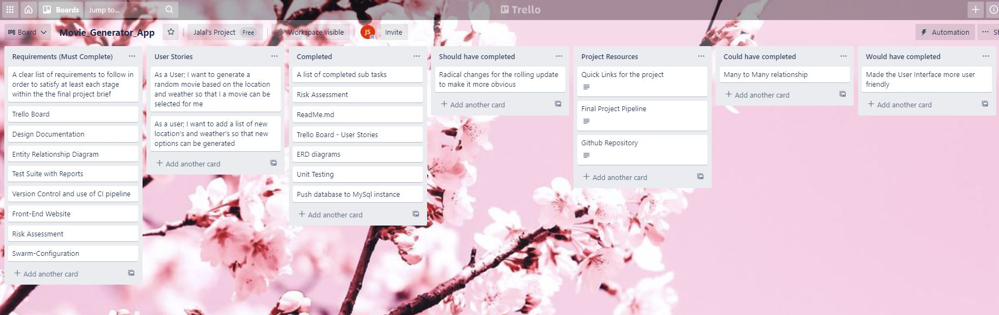
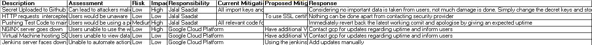
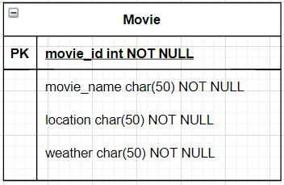
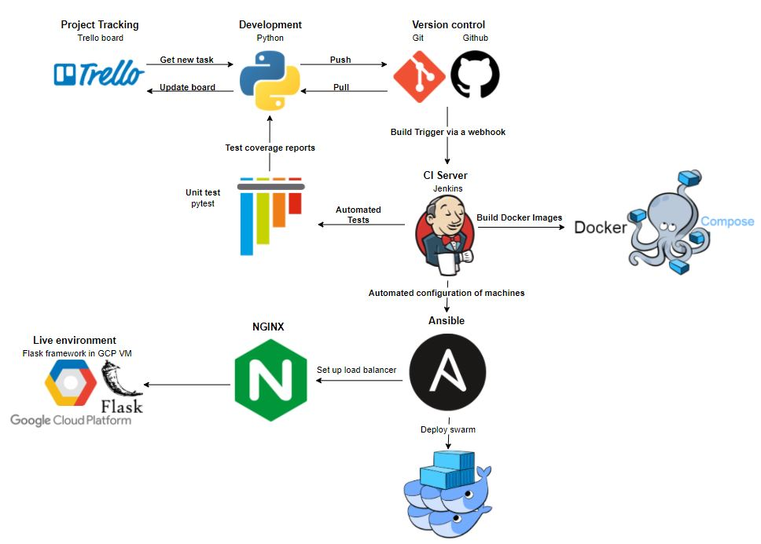
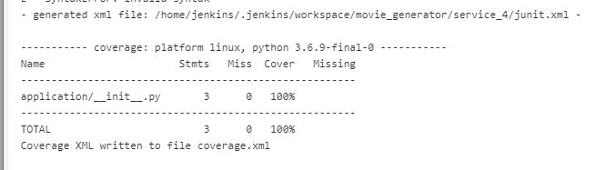
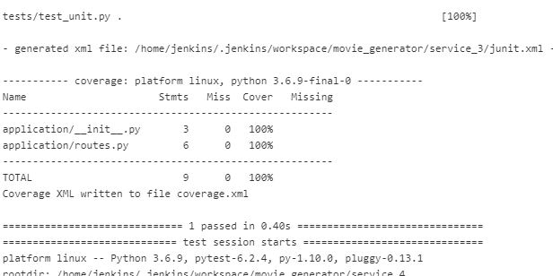
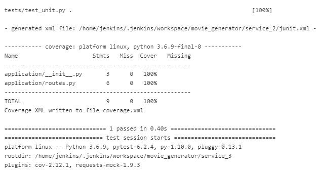
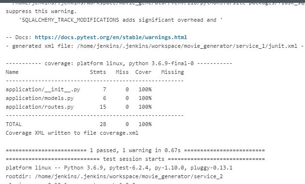

# movie-generator

## Contents
* [Introduction ](#introduction )
   * [Objective](#objective)
   * [My Project Proposal ](#my-project-proposal )
* [Software Architecture ](#software-architecture )
   * [Project Tracking ](#project-tracking)
   * [Risk Assessment](#risk-assessment)
   * [Entity Relationship Diagram](#entity-relationship-diagram)
   * [CI Pipeline](#ci-pipeline)
* [Software Infrastructure](#software-infrastructure)
   * [Jenkins](#jenkins)
   * [Swarm Configuration](#swarm-configuration)
   * [Services Setup](#Services-Setup)
* [Testing](#testing)
* [Future Improvements](#future-improvements)
* [Author](#author)

## Introduction 
### Objective
This is an individual project in order to meet the requirements of the project. The goal of this project is to create a web application which works around the microservice architecture model. The purpose of this is to allow for the splitting up and integration of the application into more manageble components as opposed to one monolithic application which comprises of all code.

The purpose of a services 2,3 and 4 are to ensure their content is displayed via integration onto service 1, the core service, i.e. the front-end that the user will see. Here will contain the relevant html template files. Service 2 and 3 will generate a random outcome; service 4 will then select an outcome based off of the randomly generated outcome of service 2 and 3. Ultimately, the outcome of all 3 services will be outputted using Service 1.

The constraints are as follows: 
* Kanban Board: Asana or an equivalent Kanban Board
* Version Control: Git
* CI Server: Jenkins
* Configuration Management: Ansible
* Cloud server: GCP virtual machines
* Containerisation: Docker
* Orchestration Tool: Docker Swarm
* Reverse Proxy: NGINX

### My Project "Movie_Generator" 
My project is such that a user will be given a random movie to based off of a given location and weather. The user will first connect to service 1 which will display the webpage up front, simultaneously, a GET request is made to service 2 and service 3 whereby each service will return a given location and weather. Finally a POST request is then sent to service 4 which is the information regarding the location and weather that was acquired from the  GET requests. Service 4 will then automatically select a film based on that information.

* Service_1: Core template which illustrates the app.
* Service_2: Generates a random City.
* Service_3: Generates a random Weather.
* Service_4: Generates a response based off of the information acquired from service_1 and service_2.

## Software Architecture 
### Project tracking
In order to track the progress and criteria of my project Trello was utilized to for this particular project. Although it was optional and the specification wasn't too strict, I felt that Trello was appropriate due to its simplicity. You can find the link to my Trello board here:

* Project Resources - Containing relevant links
* User Stories - Each card has the format "As a [User]..., I want... [Feature], so that... [Details]"
* Backlog - Tasks needed to be done
* In-Progress - Tasks currently being worked on
* Testing - Features that need to be tested
* Complete - All completed tasks
* Issues - Any issues that came up

### Risk Assessment
The risk assessment for this project can be found in full here: https://drive.google.com/file/d/1kQ4BIwtn_cRDNRL36GDttJMR94-5I0Nz/view?usp=sharing
Here's a quick screenshot:

### Entity Relationship Diagram
For the sake of this project, only one ERD is needed. The image below shows the "Movie" ERD which contains the id, name, location and weather. This table will help us create data that persists in the database after each refresh.

### CI Pipeline
The image below shows the CI Pipeline used for this project. The first thing to be done is to grab a task from the trello board, then after completing that task, the code is pushed to GitHub which triggers a webhook. This then starts the Jenkins pipeline, first the tests are done. Then using Docker-compose, the images are built and pushed to Dockerhub. Jenkins then uses Ansible to configure external nodes, including installing docker on them. Anisble also configures an NGINX node to act as a load balancer. The user connects to the load balancer and recieves the webpage. 

## Software Infrastructure
### Jenkins 
Jenkins is an open source automation server that automates many parts of the project, including testing and deployment. This helps facilitate continous integration and deployment. For this project, the stages of the Jenkins pipeline is as follows: 
* Testing - Which produces coverage reports on the console
* Build and push images - Docker-compose is used to build the images and push them to Docker-Hub
* Ansible configuration - Allows us to configure several servers at once, including
* * Installing necessary dependencies
* * Initializing the swarm and connecting to worker nodes
* * Configuring the NGINX server for load-balancing
* Deploy stack - Configures the web-applcation on the manager and worker nodes

Details on the stages used in the Jenkins pipeline can be found in the jenkinsfile.
Throughout my project, I utilised Jenkins with a webhook connected to my github. The purpose of this was to successfully push a jenkins build the moment an update is added to github.

### Swarm Configuration
The below image shows the basic set up of the swarm. After Ansible installs docker on both swarm-manager and swarm-worker nodes, it then initialises the swarm on the manager node and joins the worker nodes. 

### Services Setup
As mentioned before, the project must include atleast 4 services as part of the MVP. The below image shows the set up of the services for this project.  The front-end recieves GET requests from service 1 and 2, then posts that information to service 4, which returns an object, this is a simple set up. 

## Testing
pytest is used to run unit tests on the app. These are designed to assert that if a certain function is run, the output should be a known value. It is a method of authentication or validation to one's code. Jenkins produces console outputs (pictured below) that will inform the developer how many tests the code passed and which tests they failed.

pytest also produces a coverage report to show how much of the code in the app has been successfully tested. Jenkins automatically moves this report to the 'templates' folder so that it can be navigated to in a browser. The following value: 66% is the result of running pytest on my web app.

A junit.xml is also produced which allows us to make use of a Jenkins plugin called Junit. This gives us a graphical view of the test results, making it easier to debug if any errors arise.

## Future Improvements 
There are many improvements that can be made to the application. However, to name a few:

* Implement an external api call to get the users location, and the weather 
* Reduce downtime by using upgraded tools such as Kubernetes instead of swarm or Nexus instead of Dockerhub
* Add even more testing because more testing = more reliability. Include integration testing on top of existing unit testing.

## Author
Jalal Saadat 